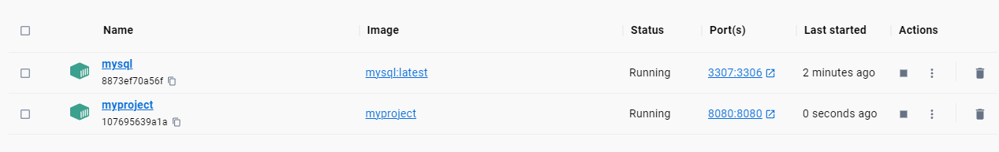
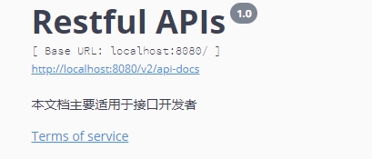

# MyOrder System

## Introduction

The project uses springboot and mysql, and implements all the features that meet the requirements very well
## Get Started

1. git clone
2. Provide your apiky in application.yml


3. run command
 ```
  ./start.sh
  ```

4.http://localhost:8080/swagger-ui.html, do the test



5.I commented out the code for the unit test. Please remove the comment if you want to use it.
## Regrets of the project

1.Docker cannot mount the local init.sql file

2.Local tests all succeed, but the project cannot connect to the mysql container


